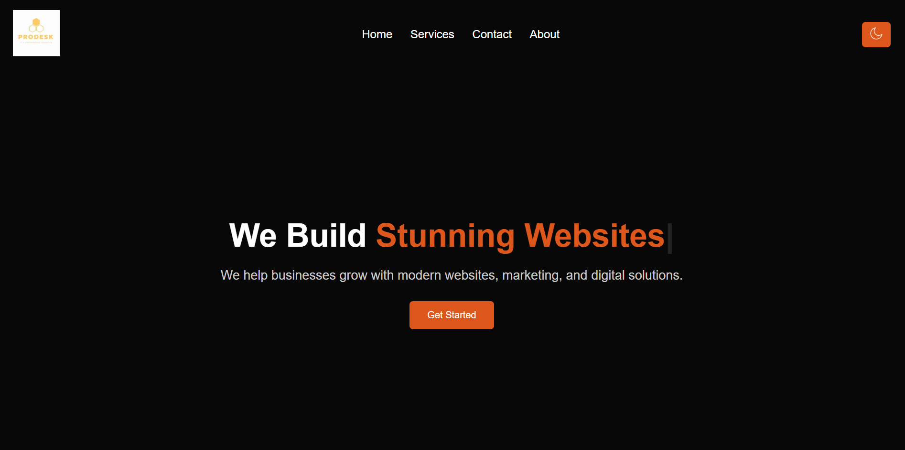
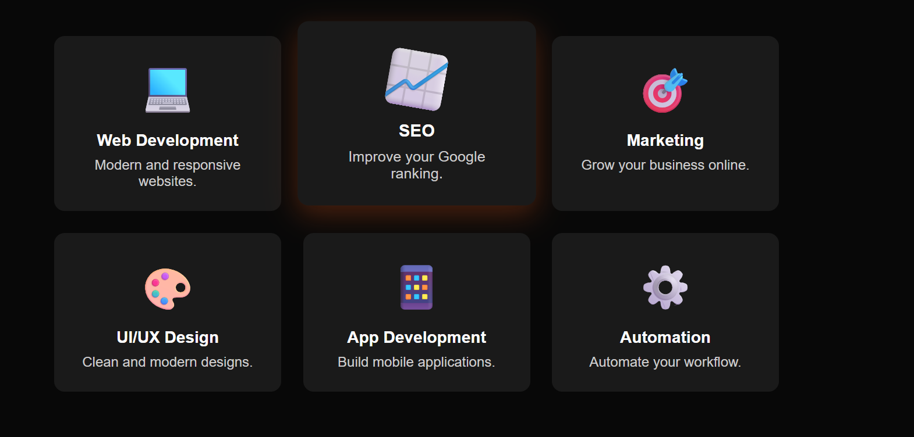
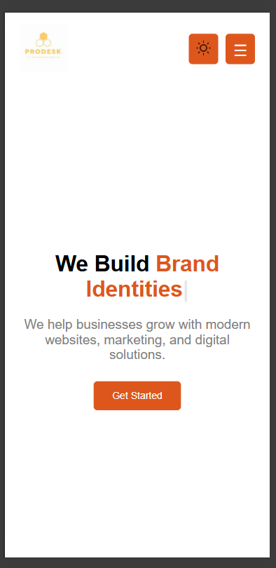
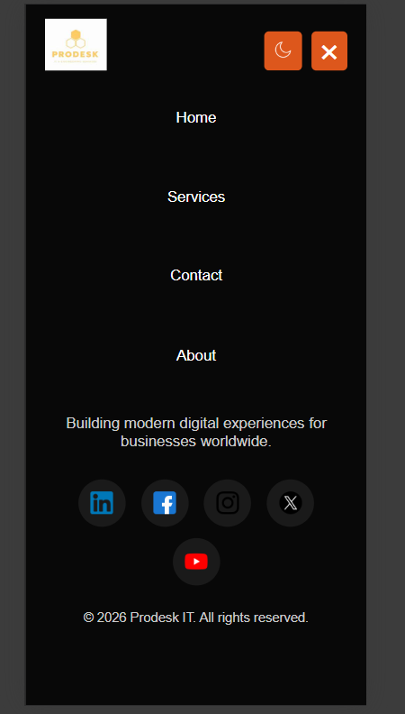

# Prodesk IT Website

A responsive business website built using HTML, CSS, and JavaScript.

## Features
- Responsive navbar with mobile menu
- Dark mode toggle
- Typing animation on hero section
- Scroll animation for service cards
- Responsive design for mobile and desktop

## How to Run
1. Download or clone the repository
2. Open `index.html` in any browser

## Screenshot

## Tech Used
- HTML
- CSS
- JavaScript
# live link of the website
https://prodesk-it-website.netlify.app/